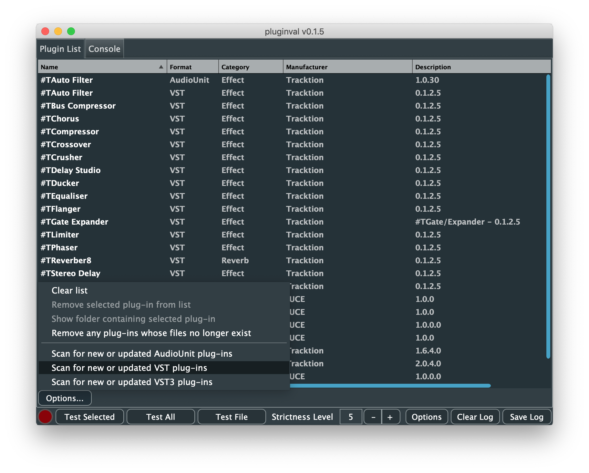
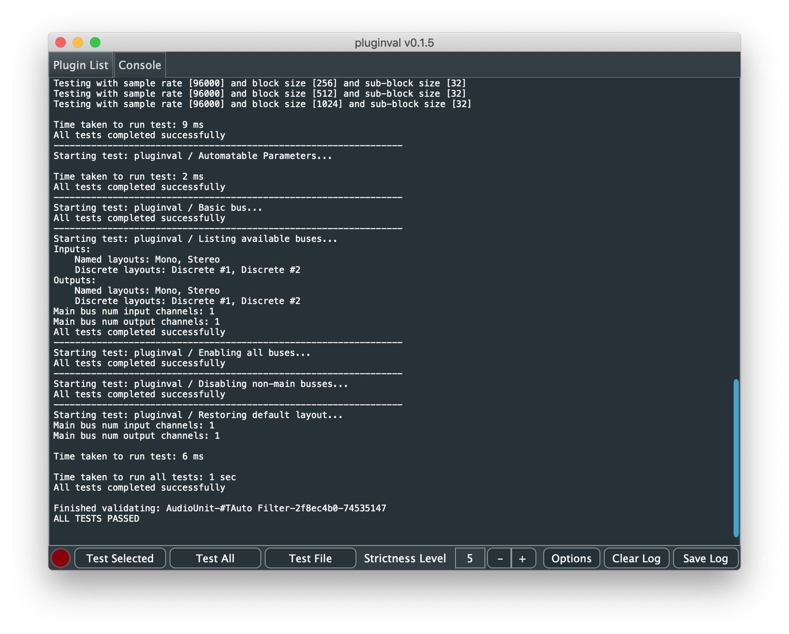

# Testing plugins with pluginval

`pluginval` can be used by a variety of users. If you're a plugin developer check out [Adding pluginval to CI.md](<Adding pluginval to CI.md>) for instructions of how to automatically validate the plugins you develop.

This guide focuses on non-developers and how they can use `pluginval` to validate problem plugins and then share these logs with the relevant host and plugin developers. Sharing log files like this really speeds up the time it takes to fix issues and get you up and running with a stable system.

###### *Overview*
1. Download the latest `pluginval` binary for your platform and run it
2. Perform a plugin scan
3. Validate the problematic plugin
4. Save the log file to send to the developers
5. If the scanning fails, use the "Test File" option

##### 1. Download the latest `pluginval` binary for your platform
 - [Windows](https://github.com/Tracktion/pluginval/releases/download/latest_release/pluginval_Windows.zip)
 - [Mac](https://github.com/Tracktion/pluginval/releases/download/latest_release/pluginval_macOS.zip)
 - [Linux](https://github.com/Tracktion/pluginval/releases/download/latest_release/pluginval_Linux.zip)

Once, downloaded, unzip the file and run the application.

##### 2. Perform a plugin scan
Once `pluginval` has press the "Options..." button and perform a plugin scan for the format of the problematic plugin. Ensure that the "Strictness Level" option is set to "5" or more.

Once scanned, the plugin list should be populated as above. If the pluginval crashes during scanning see step 5 below for an alternative method.

##### 3. Validate the problematic plugin
Select the problematic plugin from the list and press the "Test Selected" button. The status light will turn orange to indicate a validation is in progress. You can switch to the "Console" tab to see the output of the validation.

##### 4. Save the log file to send to the developers
Press the "Save log" button to save the contents of the console to a file. You can then send this to support for the plugin and host manufacturers.

To avoid other validations in the log files, use the "Clear log" button before performing the scan.
Alternatively, you can select just the most recent scan text and copy/paste that.

##### 5. If the scanning fails, use the "Test File" option
If the plugin fails to scan correctly, you can use the "Test File" button to select the actual plugin file (e.g. "plugin_name.dll", "plugin_name.vst3", "plugin_name.component") to validate. It's unlikely to succeed, but doing this gives more detail in the log files about why the scan failed. You can then send this section of the log output to the developers.

### Additional options and defaults
There are a number of options for advanced validation in `pluginval`. However, for reporting issues, the defaults should be used. These are as follows:

The most important of these is that the "Validate in process" option is turned off (i.e. unticked) or a failed validation will bring down the app and you'll lose the log file.
